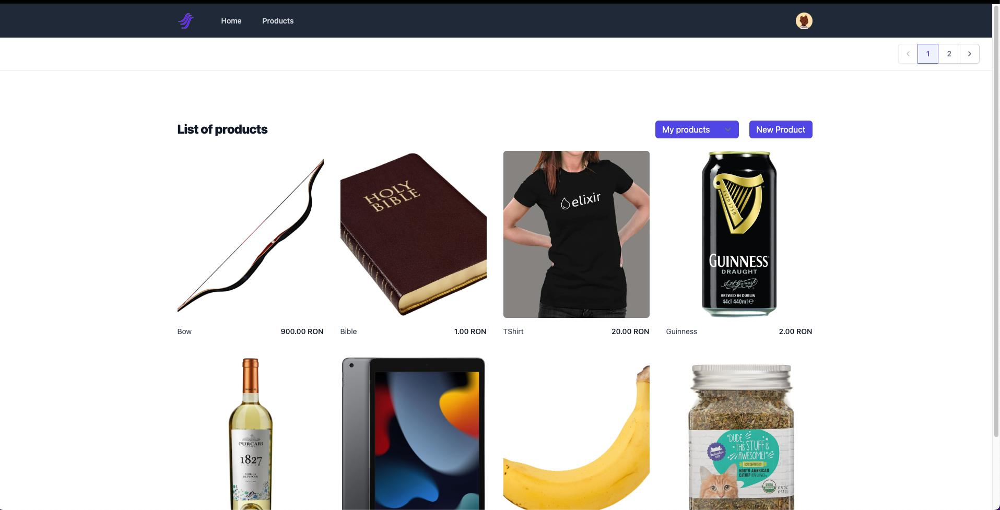

# DanubianTrade
Eshop application written using Phoenix.

## Prerequisites
* [Docker](https://www.docker.com/)
* [Elixir](https://elixir-lang.org/)

## Starting up
To start the database service:
  * `docker compose up`

To start your Phoenix server:
  * Install dependencies with `mix deps.get`
  * Create and migrate your database with `mix ecto.setup`
  * Start Phoenix endpoint with `mix phx.server` or inside IEx with `iex -S mix phx.server`
  * After creating your first user you can run `mix seed.products` to create some products

Now you can visit [`localhost:4000`](http://localhost:4000) from your browser.

## Database description
The DanubianTrade database is a MariaDB database (version `10.6.0`). It contains the following tables:
* `schema_migrations` - table containing the schema migrations
* `users` - users of the application
* `user_tokens` - tokens used to authenticate users
* `products` - products that the users can create or buy 
* `carts` - carts containing products
* `cart_products` - products in carts
* `orders` - orders containing products
* `order_products` - products in orders

Its structure is the following:

It also contains the following particularities:
* The `carts` table is populated using the `add_cart(user_id, product_id, quantity)` stored procedure, which essentially applies an `INSERT_OR_UPDATE` operation (if no cart exists, it is created, otherwise it's updated).
* Removing a product from a cart is done by means of the `remove_from_cart(product_id, user_id)` stored procedure.
* For paranoia reasons, there exists a unique constraint on the `cart_id` and `product_id` columns of the `cart_products` table.
* Fetching the products in a user's cart is done by means of the `get_user_cart_products(user_id)` stored procedure. It returns a list of products, along with their cart quantities and total price
* There's an insert trigger on the `cart_products` table to decrement the available product quantity when a product is added to a cart.
* There's also an update trigger on the `cart_products` table to decrement the available product quantity when a product is added to an existing cart.
* There's a delete trigger on the `cart_products` table to reimburse the available product quantity when a product is removed from a cart.
* The `order_number` column of the `orders` table has a unique index constraint attached to it.
* Adding an order is done by means of the `add_order(order_number, cart_id)` stored procedure. Succinctly, it does the following:
  1. It inserts the new order into the `orders` table
  2. It inserts the products in the cart into the `order_products` table
  3. It calculates the total order price and then updates the `orders` table with the resulting value
* There's an update trigger on the `orders` table which applies a soft delete to the cart when an order is created from it.
* There's also a function called `get_user_cart_id(user_id)` which does nothing more than returning the cart id of the user's cart.

## Feature set
- [x] User registration
- [x] User login
- [x] Email confirmation (requires SMTP server for production)
- [x] User password reset
- [x] Uniquely generated user avatars
- [x] Persistent user session
- [x] Paginated product listing
- [x] Product detail
- [x] Product creation and editing
- [x] Cart creation and editing
- [x] Order creation
- [x] Order listing
- [ ] Order detail
- [ ] Image upload
- [ ] Out of stock product marking
- [ ] Order product quantity display

## Screenshots
* Home page
    
* Register page
    
* Login page
    
* Product listing when not logged in
    
* Product listing when logged in
    
* Owned product detail
    
* Out of stock product detail
    
* On stock product detail
    
* User menu
    
* Empty cart
    
* Cart with products
    
* Orders empty
    
* Orders with products
    

## Learn more

  * Official website: https://www.phoenixframework.org/
  * Guides: https://hexdocs.pm/phoenix/overview.html
  * Docs: https://hexdocs.pm/phoenix
  * Forum: https://elixirforum.com/c/phoenix-forum
  * Source: https://github.com/phoenixframework/phoenix
